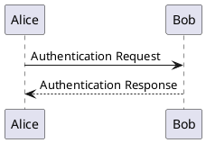
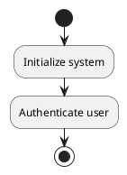

# Test Note with PlantUML

Here is a simple sequence diagram:

```plantuml
@startuml
Alice -> Bob: Authentication Request
Bob --> Alice: Authentication Response
@enduml
```

And here is an activity diagram:

```plantuml
@startuml
start
:Initialize system;
:Authenticate user;
stop
@enduml
```

This text should remain unchanged.
